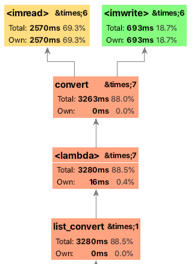

## OpenCVを使ったJPEG2000の画像からJPEGへの変換

Pythonとの統合モジュールを利用することで簡単に記述することができる。

### 性能特性
PyCharmで性能特性を図るためにProfile実行してみた結果
1MB程度（総計7.2MB）を6枚を処理した結果。



OpenCVの読み込み処理に時間がかかっていることがわかる。

```md
別プログラム(fileread.py)でnumpy.fromFile
で読み込むとすべてのファイルを2桁ミリ秒でファイルを読み込むことができるのでJPEG2000ファイルの解析に時間が時間がかかっているようです。
```


###　実行方法
python main.py InputDirectory OutputDirectory


